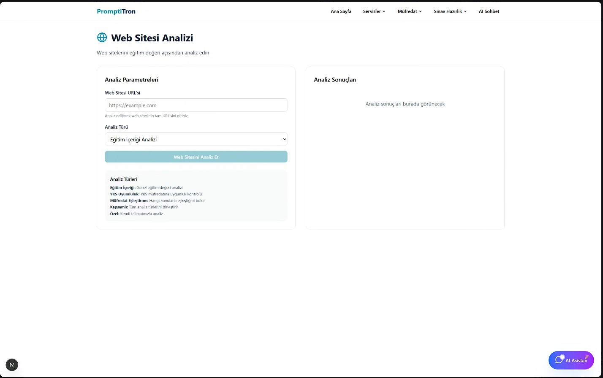

# 🚀 Promptitron Final - Birleşik AI Eğitim Sistemi

> **Türkiye'nin En Kapsamlı Yapay Zeka Destekli Eğitim Platformu**  
> Modern AI teknolojileriyle güçlendirilmiş, çoklu arayüz destekli eğitim sistemi

[](https://www.python.org/downloads/)
[](https://fastapi.tiangolo.com/)
[](https://nextjs.org/)
[](https://www.typescriptlang.org/)
[](https://www.docker.com/)
[](https://opensource.org/licenses/MIT)

---

## 📋 İçindekiler

1. [Sistem Özeti](#-sistem-özeti)
2. [Çoklu Arayüz Mimarisi](#-çoklu-arayüz-mimarisi)
3. [Teknoloji Stack](#-teknoloji-stack)
4. [Proje Yapısı](#-proje-yapısı)
5. [Kurulum & Çalıştırma](#-kurulum--çalıştırma)
6. [Docker ile Kurulum](#-docker-ile-kurulum)
7. [API Dokümantasyonu](#-api-dokümantasyonu)
8. [Özellikler](#-özellikler)

---

## 🎯 Sistem Özeti

**Promptitron Final**, eğitim sektörüne özel olarak tasarlanmış, çoklu arayüz destekli bir yapay zeka sistemidir. Proje 4 farklı kullanım senaryosu için optimize edilmiştir:

### 🎭 **Çoklu Çalışma Modları**
- **🖥️ Konsol Uygulaması**: Terminal tabanlı etkileşimli sistem (main.py / console_app.py)
- **🌐 Web API**: RESTful API servisleri (FastAPI tabanlı)
- **💻 Web Arayüzü**: Modern React/Next.js frontend (client/ dizini)
- **🐳 Docker Desteği**: Mikroservis mimarisinde konteyner desteği
- **📊 Monitoring**: Sistem durumu ve performans izleme

### 🧠 **AI & Veri Mimarisi**
- **Google Gemini 2.5**: Pro/Flash/Flash-Lite model desteği
- **RAG Sistemi**: ChromaDB tabanlı vektör arama
- **LangChain/LangGraph**: Akıllı agent sistemleri
- **CrewAI**: Çoklu-agent işbirliği
- **Çoklu Format Desteği**: PDF, Word, Web, YouTube analizi

---

## 🏛️ Çoklu Arayüz Mimarisi

### 🖥️ **1. Konsol Uygulaması** (`main.py` / `console_app.py`)
```
📁 console_app_modules/
├── 🧠 ai_assistant.py          # AI Assistant modülü
├── 🎯 core_manager.py          # Ana yönetici sistem
├── 📚 curriculum_manager.py    # Müfredat yönetimi
├── 📊 export_manager.py        # Veri dışa aktarım
├── 🔍 knowledge_search.py      # Bilgi arama sistemi
├── ❓ question_generator.py    # Soru üretim sistemi
├── 📅 study_planner.py         # Çalışma planlayıcısı
├── 🏥 system_status.py         # Sistem durumu
└── 📝 content_analysis/        # İçerik analiz modülleri
```

### 🌐 **2. Web API Sistemi** (`api/`)
```
📁 api/
├── 🎬 main.py                  # FastAPI ana uygulama
├── 🛣️ routers/                # API endpoint'leri
│   ├── 💬 chat/               # Sohbet sistemi
│   ├── 📖 curriculum/         # Müfredat API'leri
│   ├── 📄 content/            # İçerik işleme
│   ├── ⚡ generation/         # Soru/içerik üretimi
│   ├── 🎓 student/            # Öğrenci yönetimi
│   ├── 🔧 system/             # Sistem API'leri
│   ├── 🔍 search/             # Arama servisleri
│   ├── ✅ validation/         # Doğrulama
│   └── 🤖 crew/              # CrewAI entegrasyonu
├── 🏗️ controllers/            # Business logic
├── 📋 models/                 # Veri modelleri
└── 🔌 middleware/             # Ara katman
```

### 💻 **3. Web Arayüzü** (`client/`)
```
📁 client/
├── 📱 app/                    # Next.js 15 App Router
│   ├── 📖 (lessons)/         # Ders sayfaları (LGS/YKS)
│   ├── 🎯 curriculum/        # Müfredat arayüzleri
│   ├── 🔧 services/          # Servis sayfaları
│   └── 💬 ai-chat/          # AI sohbet arayüzü
├── 🎨 components/             # UI komponentleri
├── 📚 lib/                   # Utility'ler & API client
└── 🖼️ public/               # Statik dosyalar
```

### 🐳 **4. Docker Mikroservis** (Multi-container)
```
🐳 Docker Containers:
├── 📦 Dockerfile.api          # API servisi
├── 📦 Dockerfile.console      # Konsol uygulaması
├── 📦 Dockerfile.worker       # Arka plan işleri
└── 📦 Dockerfile.monitor      # İzleme servisi
```

---

## 🛠️ Teknoloji Stack

### **🐍 Core Backend**
| Teknoloji | Versiyon | Kullanım Alanı |
|-----------|----------|---------------|
| **Python** | 3.13+ | Ana geliştirme dili |
| **FastAPI** | 0.116+ | Modern web API framework |
| **Uvicorn** | 0.35+ | ASGI server |
| **Pydantic** | 2.11+ | Veri validasyon ve parsing |
| **SQLAlchemy** | 2.0+ | ORM ve veritabanı |

### **🤖 AI & Machine Learning**
| Teknoloji | Versiyon | Kullanım Alanı |
|-----------|----------|---------------|
| **Google Gemini 2.5** | Latest | Ana LLM modeli (Pro/Flash/Flash-Lite) |
| **LangChain** | 0.3.27 | LLM orkestrasyon ve chains |
| **LangGraph** | 0.6.3 | AI agent workflow sistemi |
| **CrewAI** | 0.152.0 | Çoklu-agent işbirliği |
| **ChromaDB** | 1.0.15 | Vektör veritabanı ve RAG |
| **Sentence Transformers** | 5.0.0 | Embedding modelleri |
| **Transformers** | 4.54.1 | Hugging Face modelleri |

### **💻 Frontend & UI**
| Teknoloji | Versiyon | Kullanım Alanı |
|-----------|----------|---------------|
| **Next.js** | 15.4.5 | React framework ve SSR |
| **React** | 19.1.0 | UI kütüphanesi |
| **TypeScript** | 5.x | Type güvenliği |
| **Tailwind CSS** | 4.x | Modern CSS framework |
| **Radix UI** | Latest | Headless UI komponentleri |
| **Lucide React** | 0.536.0 | İkon kütüphanesi |

### **🔧 Sistem & DevOps**
| Teknoloji | Versiyon | Kullanım Alanı |
|-----------|----------|---------------|
| **Docker** | Latest | Konteynerizasyon |
| **Docker Compose** | Latest | Multi-container orkestrasyon |
| **Rich** | 14.1.0 | Terminal UI ve logging |
| **Typer** | 0.16.0 | CLI arayüzleri |
| **OpenTelemetry** | 1.36.0 | Monitoring ve observability |

---

## 📁 Proje Yapısı

```
promptitron_final/
├── 🎬 **Ana Çalıştırma Dosyaları**
│   ├── main.py                 # Konsol+API birleşik başlatıcı
│   ├── console_app.py          # Sadece konsol uygulaması
│   ├── run.py                  # Alternative launcher
│   └── config.py              # Ana konfigürasyon
│
├── 🌐 **API Sistemi** (FastAPI)
│   ├── api/main.py            # FastAPI ana uygulama
│   ├── api/routers/           # Modüler API endpoints
│   │   ├── chat/              # Sohbet API'leri
│   │   ├── curriculum/        # Müfredat API'leri
│   │   ├── content/           # İçerik işleme API'leri
│   │   ├── generation/        # Soru/içerik üretim API'leri
│   │   ├── search/            # Arama API'leri
│   │   └── system/            # Sistem API'leri
│   ├── api/controllers/       # Business logic katmanı
│   ├── api/models/            # Pydantic veri modelleri
│   └── api/middleware/        # Request/response middleware
│
├── 🖥️ **Konsol Uygulaması**
│   ├── console_app_modules/   # Konsol modülleri
│   │   ├── core_manager.py    # Ana yönetici
│   │   ├── ai_assistant.py    # AI asistan arayüzü
│   │   ├── curriculum_manager.py # Müfredat yönetimi
│   │   ├── question_generator.py # Soru üretici
│   │   ├── study_planner.py   # Çalışma planlayıcısı
│   │   ├── knowledge_search.py # Bilgi arama
│   │   ├── export_manager.py  # Veri dışa aktarım
│   │   ├── system_status.py   # Sistem durumu
│   │   └── content_analysis/  # İçerik analiz modülleri
│   └── utils/                 # Konsol yardımcıları
│
├── 🧠 **Core AI Sistemi**
│   ├── core/agents.py         # LangGraph agent sistemi
│   ├── core/gemini_client.py  # Google Gemini entegrasyonu
│   ├── core/rag_system.py     # Retrieval-Augmented Generation
│   ├── core/conversation_memory.py # Sohbet hafızası
│   ├── core/curriculum_loader.py # Müfredat yükleyici
│   ├── core/document_understanding.py # Döküman analizi
│   ├── core/web_analyzer.py   # Web içerik analizi
│   ├── core/youtube_analyzer.py # YouTube video analizi
│   └── core/socratic_agent.py # Socratic öğretim ajanı
│
├── 💻 **Web Frontend** (Next.js)
│   ├── client/app/            # Next.js 15 App Router
│   │   ├── (lessons)/         # Ders kategorileri (LGS/YKS)
│   │   ├── curriculum/        # Müfredat arayüzleri
│   │   ├── services/          # Servis sayfaları
│   │   └── ai-chat/          # AI sohbet arayüzü
│   ├── client/components/     # React komponentleri
│   │   ├── ui/               # Temel UI komponentleri
│   │   ├── header/           # Header komponenti
│   │   └── logo.tsx          # Logo komponenti
│   ├── client/lib/           # Frontend utilities
│   │   ├── api/client.ts     # API client
│   │   └── hooks/useApi.ts   # React hooks
│   └── client/public/        # Statik dosyalar ve kazanımlar
│
├── 🗄️ **Veri & Veritabanı**
│   ├── chroma_db/            # ChromaDB vektör veritabanı
│   ├── data/jsonn/           # Müfredat JSON verileri
│   ├── uploads/              # Yüklenen dosyalar
│   └── models/               # Veri modeli tanımları
│
├── 🐳 **Docker & Deployment**
│   ├── Dockerfile.api        # API servisi container'ı
│   ├── Dockerfile.console    # Konsol uygulaması container'ı
│   ├── Dockerfile.worker     # Background worker container'ı
│   ├── Dockerfile.monitor    # Monitoring container'ı
│   ├── docker-compose.yml    # Multi-container orkestrasyon
│   ├── docker-compose.simple.yml # Basit deployment
│   └── dokploy.json          # Dokploy deployment config
│
├── 📊 **Monitoring & Scripts**
│   ├── scripts/monitor.py    # Sistem izleme
│   ├── scripts/worker.py     # Background işler
│   └── diagrams/             # Sistem diyagramları
│
└── 📝 **Konfigürasyon & Docs**
    ├── requirements.txt      # Python bağımlılıkları
    ├── pyproject.toml       # Python project config
    ├── README.md            # Bu dosya
    ├── README-Docker.md     # Docker dokümantasyonu
    └── README-Dokploy.md    # Dokploy deployment
```

---

## 📚 Detaylı Özellikler

### **1. YKS Kazanımları Sistemi**
- **Kapsamlı Müfredat**: 10 farklı ders (Matematik, Fizik, Kimya, Biyoloji, vb.)
- **Hiyerarşik Yapı**: Ders → Sınıf → Konu → Kazanım
- **İnteraktif Seçim**: Checkbox tabanlı çoklu seçim
- **Görsel Organizasyon**: Genişletilebilir ağaç yapısı
- **Otomatik Parsing**: JSON verilerinin akıllı işlenmesi

### **2. Soru Üretim Sistemi**
- **Çoklu Format**: Multiple choice, True/False, Fill-in-blank, Essay
- **Zorluk Seviyeleri**: Easy, Medium, Hard
- **Sınav Tipları**: TYT, AYT, YKS, LGS
- **Müfredat Entegrasyonu**: Seçili kazanımlara dayalı
- **Otomatik Cevap Anahtarı**: Açıklamalı çözümler

### **3. İçerik Analizi**
- **Metin Analizi**: 6 farklı analiz tipi
- **Döküman Analizi**: PDF, Word, Text, Markdown desteği
- **Web Analizi**: URL tabanlı içerik çözümlemesi
- **YouTube Analizi**: Video transkript ve özet
- **AI Destekli**: Gemini 2.5 ile güçlendirilmiş

### **4. RAG (Retrieval-Augmented Generation)**
- **Hibrit Arama**: Semantic + Keyword search
- **Çoklu Koleksiyon**: Curriculum, conversations, documents
- **Akıllı Reranking**: LLM-based result optimization
- **Kişiselleştirme**: User profile based filtering
- **Cache Sistemi**: Performance optimizasyonu

### **5. Konuşma ve Bellek**
- **Context Aware**: Sohbet geçmişi takibi
- **Long-term Memory**: Öğrenci profili hafızası
- **Session Management**: Oturum bazlı konuşmalar
- **Personalization**: Öğrenme stiline göre uyarlama

### **6. Uzman Sistem**
- **Ders Uzmanları**: Her ders için özelleşmiş AI
- **Otomatik Routing**: Soru tipine göre uzman seçimi
- **LangGraph Integration**: Workflow tabanlı işlem
- **Function Calling**: Yapılandırılmış çıktılar
- **Multi-agent Collaboration**: Uzmanlar arası işbirliği

### **7. Modern Web Arayüzü**
- **Responsive Design**: Mobil-first yaklaşım
- **Component Based**: Yeniden kullanılabilir UI
- **Real-time Updates**: Live data synchronization
- **File Upload**: Drag & drop file handling
- **Error Handling**: Kullanıcı dostu hata yönetimi

### **8. API ve Entegrasyonlar**
- **RESTful API**: Standardize endpoint'ler
- **OpenAPI Docs**: Otomatik dokümantasyon
- **Rate Limiting**: API kullanım koruması
- **CORS Support**: Cross-origin request desteği
- **Type Safety**: Pydantic model validation

---

## ⚡ Kurulum & Çalıştırma

### **📋 Ön Gereksinimler**
- **Python 3.13+** (önerilen)
- **Node.js 18+** & **npm/yarn**
- **Google Gemini API Key** 
- **Git**
- **Docker** (opsiyonel, konteyner deployment için)

### **1. 📥 Repository Klonlama**
```bash
git clone https://github.com/your-username/promptitron-final.git
cd promptitron-final
```

### **2. 🐍 Python Ortamı Kurulumu**
```bash
# Virtual environment oluştur
python -m venv venv

# Activate (Windows)
venv\Scripts\activate

# Activate (Linux/Mac)
source venv/bin/activate

# Dependencies yükle
pip install -r requirements.txt
```

### **3. 🌐 Frontend Kurulumu** (Opsiyonel - sadece web arayüzü için)
```bash
cd client
npm install
# veya
yarn install
cd ..
```

### **4. ⚙️ Environment Konfigürasyonu**
```bash
# Ana dizinde .env dosyası oluştur
# .env
GOOGLE_API_KEY=your_google_gemini_api_key_here
SECRET_KEY=your_secret_key_here
DEBUG=true
APP_VERSION=1.0.0
```

### **5. 🚀 Çalıştırma Seçenekleri**

#### **A) 🖥️ Sadece Konsol Uygulaması**
```bash
python console_app.py
```

#### **B) 🌐 Sadece Web API**
```bash
uvicorn api.main:app --reload --host 0.0.0.0 --port 8000
```

#### **C) 🎭 Konsol + API Birlikte** (Önerilen)
```bash
python main.py
```
Bu mod hem konsol arayüzünü hem de arka planda API sunucusunu başlatır.

#### **D) 💻 Web Frontend** (Ayrı terminal'de)
```bash
cd client
npm run dev
```

### **6. 🔗 Erişim Noktaları**
| Servis | URL | Açıklama |
|---------|-----|----------|
| **Konsol App** | Terminal | Etkileşimli konsol arayüzü |
| **Web API** | http://localhost:8000 | RESTful API servisleri |
| **API Docs** | http://localhost:8000/docs | Swagger UI dokümantasyon |
| **Health Check** | http://localhost:8000/health | Sistem durumu |
| **Web Frontend** | http://localhost:3000 | React/Next.js web arayüzü |

---

## 🐳 Docker ile Kurulum

Proje çoklu Docker container desteğiyle gelir:

### **🚀 Hızlı Başlangıç**
```bash
# Basit deployment (tek konteyner)
docker-compose -f docker-compose.simple.yml up -d

# Tam mikroservis deployment
docker-compose up -d
```

### **📦 Kullanılabilir Konteynerlar**
```bash
# API Servisi
docker build -f Dockerfile.api -t promptitron-api .

# Konsol Uygulaması
docker build -f Dockerfile.console -t promptitron-console .

# Background Worker
docker build -f Dockerfile.worker -t promptitron-worker .

# Monitoring Servisi
docker build -f Dockerfile.monitor -t promptitron-monitor .
```

### **🔧 Docker Compose Servisleri**
| Servis | Port | Açıklama |
|---------|------|----------|
| **api** | 8000 | FastAPI backend servisi |
| **console** | - | Terminal tabanlı arayüz |
| **worker** | - | Arka plan işleme servisi |
| **monitor** | 9090 | Sistem izleme servisi |
| **frontend** | 3000 | Next.js web arayüzü |

### **📋 Dokploy Deployment**
Dokploy platformu için hazır konfigürasyon:
```bash
# dokploy.json dosyası kullanılarak deployment
dokploy deploy
```

---

## 🔌 API Dokümantasyonu

### **Authentication**
```http
Authorization: Bearer YOUR_API_KEY
Content-Type: application/json
```

### **Core Endpoints**

#### **1. Chat System**
```http
POST /chat
{
    "message": "Matematik türev konusunu açıkla",
    "student_id": "student_123",
    "session_id": "session_456",
    "use_memory": true,
    "context": {}
}
```

#### **2. Question Generation**
```http
POST /generate/questions
{
    "subject": "matematik",
    "topic": "türev",
    "difficulty": "medium",
    "question_type": "multiple_choice",
    "count": 5,
    "exam_type": "YKS"
}
```

#### **3. Curriculum Questions**
```http
POST /curriculum/questions
{
    "selected_topics": [
        {
            "ders": "matematik",
            "sinif": "11",
            "konu": "Türev",
            "kazanim": "Türev kurallarını uygular",
            "title": "Türev Kuralları"
        }
    ],
    "difficulty": "medium",
    "count": 3
}
```

#### **4. Content Analysis**
```http
POST /analyze/content
{
    "content": "Analiz edilecek metin içeriği...",
    "analysis_type": "educational",
    "include_suggestions": true
}
```

#### **5. Document Upload**
```http
POST /upload/document
Content-Type: multipart/form-data

file: [PDF/Word/Text file]
description: "Document description"
analysis_type: "general"
```

#### **6. YouTube Analysis**
```http
POST /youtube/analyze
{
    "url": "https://www.youtube.com/watch?v=...",
    "analysis_type": "educational",
    "custom_prompt": "Focus on mathematical concepts"
}
```

### **Response Format**
```json
{
    "success": true,
    "data": {
        "response": "AI generated content",
        "metadata": {
            "model_used": "gemini-2.5-flash",
            "tokens_used": 1250,
            "processing_time": 2.3
        }
    },
    "agent_used": "mathematics_expert",
    "session_id": "session_456"
}
```

---

## 🚀 Özellikler

### **🎓 Eğitim Özellikleri**
- **📖 YKS/LGS Müfredat Entegrasyonu**: 10 farklı ders desteği
- **❓ Akıllı Soru Üretimi**: Çoktan seçmeli, doğru-yanlış, açık uçlu sorular
- **📊 Kişiselleştirilmiş Çalışma Planları**: AI destekli öğrenme rotaları
- **🔍 İçerik Analizi**: PDF, Word, Web, YouTube içerik işleme
- **💬 Socratic Öğretim**: Sokratik soru-cevap metoduyla öğrenme
- **📈 İlerleme Takibi**: Detaylı performans analizi

### **🤖 AI Sistemi**
- **🧠 Google Gemini 2.5**: Pro/Flash/Flash-Lite model desteği
- **🔗 RAG Sistemi**: ChromaDB tabanlı akıllı bilgi arama
- **🕴️ Çoklu-Agent Sistemi**: LangGraph ve CrewAI entegrasyonu
- **💾 Konuşma Hafızası**: Uzun dönem öğrenci profili yönetimi
- **🎯 Otomatik Uzman Seçimi**: Konu bazlı AI uzman yönlendirmesi

### **💻 Kullanıcı Arayüzleri**
- **🖥️ Terminal Konsol**: Gelişmiş CLI arayüzü (Rich/Typer)
- **🌐 Web API**: RESTful API servisleri (FastAPI)
- **📱 Web Arayüzü**: Modern React/Next.js frontend
- **🐳 Docker Desteği**: Mikroservis mimarisi
- **📊 Monitoring**: Sistem durumu ve performans izleme

### **📁 Dosya İşleme**
- **📄 PDF Analizi**: Eğitim dokümanlarını AI ile işleme
- **📝 Word Desteği**: .docx dosya formatı desteği
- **🌐 Web Scraping**: URL'lerden içerik çekme ve analiz
- **📺 YouTube Entegrasyonu**: Video transkript ve özet çıkarma
- **💾 Otomatik Cache**: İşlenmiş içeriklerin akıllı önbelleklenmesi

---

## 📊 Sistem Diyagramları

Detaylı sistem diyagramları `diagrams/` klasöründe Mermaid formatında bulunmaktadır:

### **📈 Mevcut Diyagramlar**
1. **01_system_architecture.mmd**: Genel sistem mimarisi
2. **02_data_flow.mmd**: Veri akış şemaları  
3. **03_input_output_processes.mmd**: Girdi-çıktı süreçleri

### **🔍 Diyagram Görüntüleme**
```bash
# HTML viewer ile görüntüleme
open diagrams/mermaid_viewer.html
```

---

## 🧪 Test ve Geliştirme

### **Test Komutları**
```bash
# Backend testleri
pytest tests/

# Frontend testleri
npm test

# Integration testleri
python -m pytest tests/test_integration.py
```

### **Development Mode**
```bash
# Backend (hot reload)
uvicorn api.main:app --reload

# Frontend (hot reload)
npm run dev
```

### **Linting ve Formatting**
```bash
# Backend
black core/ api/
flake8 core/ api/

# Frontend
npm run lint
npm run format
```

---

## 🔧 Konfigürasyon

### **Environment Variables**
```env
# Core Settings
GOOGLE_API_KEY=your_google_api_key
SECRET_KEY=your_secret_key
DEBUG=true

# Database
DATABASE_URL=sqlite:///./promptitron.db
CHROMA_PERSIST_DIR=chroma_db

# API Settings
MAX_OUTPUT_TOKENS=8192
TEMPERATURE=0.7
TOP_P=0.95

# File Upload
MAX_UPLOAD_SIZE=104857600  # 100MB
UPLOAD_DIR=uploads

# Rate Limiting
RATE_LIMIT_REQUESTS=100
RATE_LIMIT_PERIOD=60
```

### **Model Configuration**
```python
# config.py
GEMINI_MODELS = {
    "pro": "gemini-2.5-pro",        # Complex reasoning
    "flash": "gemini-2.5-flash",    # General purpose
    "lite": "gemini-2.5-flash-lite" # Fast & economical
}
```

---

## 🚨 Troubleshooting

### **Yaygın Sorunlar**

#### **1. Google API Hatası**
```bash
# Hata: Invalid API key
# Çözüm: .env dosyasında API key kontrolü
echo $GOOGLE_API_KEY
```

#### **2. ChromaDB Hatası**
```bash
# Hata: ChromaDB connection failed
# Çözüm: ChromaDB yeniden oluştur
rm -rf chroma_db/
python main.py
```

#### **3. Port Çakışması**
```bash
# Hata: Port already in use
# Çözüm: Port değiştir
uvicorn api.main:app --port 8001
```

#### **4. Memory Hatası**
```python
# config.py içinde
MAX_OUTPUT_TOKENS = 4096  # Azalt
BATCH_SIZE = 10          # Küçült
```

### **Debug Mode**
```python
import logging
logging.basicConfig(level=logging.DEBUG)
```

---

## 🤝 Contributing

### **Development Workflow**
1. Fork repository
2. Create feature branch: `git checkout -b feature/amazing-feature`
3. Commit changes: `git commit -m 'Add amazing feature'`
4. Push to branch: `git push origin feature/amazing-feature`
5. Open Pull Request

### **Code Standards**
- **Python**: PEP 8, Type hints
- **TypeScript**: Strict mode, ESLint
- **Commits**: Conventional commits format
- **Documentation**: Inline comments + README updates

---

## 📄 License

Copyright (c) 2025 Promptitron Takımı

Bu yazılımın kopyalanması ve kullanılması yasaktır. Tüm hakları saklıdır.

Fatih Acar
Fatih Kabul
Giray Doruk Yurtseven

---

``

### **📋 Code Standards**
- **Python**: PEP 8, Type hints, Black formatting
- **TypeScript**: Strict mode, ESLint rules
- **Commits**: Conventional commits format
- **Documentation**: Inline comments + README updates

---

## 🚨 Troubleshooting

### **❗ Yaygın Sorunlar**

#### **Google API Hatası**
```bash
# Hata: Invalid API key
# Çözüm: .env dosyasında API key kontrolü
echo $GOOGLE_API_KEY
```

#### **ChromaDB Connection Hatası**
```bash
# Hata: ChromaDB connection failed
# Çözüm: ChromaDB klasörünü temizle
rm -rf chroma_db/
python main.py  # Yeniden oluşturulacak
```

#### **Port Çakışması**
```bash
# Hata: Port already in use  
# Çözüm: Port değiştir
uvicorn api.main:app --port 8001
```

#### **Memory Hatası**
```python
# config.py içinde token limitlerini azalt
MAX_OUTPUT_TOKENS = 4096
BATCH_SIZE = 10
```

### **🔍 Debug Mode**
```python
# Detaylı loglama için
import logging
logging.basicConfig(level=logging.DEBUG)
```


---

## 🌟 Teşekkürler

- **🤖 AI Model**: Google Gemini 2.5 Pro/Flash/Flash-Lite
- **🗄️ Vector DB**: ChromaDB Team
- **🌐 Web Framework**: FastAPI & Next.js Teams  
- **🎨 UI Library**: Radix UI & ShadCN/UI
- **🖼️ Icons**: Lucide React
- **📊 Terminal UI**: Rich & Typer
- **🐳 Containerization**: Docker

---

## 📄 Lisans

Copyright (c) 2025 Promptitron Takımı

Bu yazılımın kopyalanması ve kullanılması yasaktır. Tüm hakları saklıdır.

Fatih Acar
Fatih Kabul
Giray Doruk Yurtseven

---

## ⚠️ Yasal Uyarı

Bu sistem eğitim ve araştırma amaçlıdır. Gerçek sınav sonuçlarını garanti etmez. Profesyonel eğitim danışmanlığı almanızı öneririz.

---

<div align="center">

**🚀 Promptitron Final - Modern AI Eğitim Sistemi**

*Türkiye'nin en kapsamlı yapay zeka destekli eğitim platformu* 🇹🇷

[](https://python.org)
[](https://fastapi.tiangolo.com)
[](https://nextjs.org)
[](https://docker.com)

</div>


---

## 📸 Projeden Bazı Görseller

- 
- 
- 
- 
- 
- 
- 
- 
- 
- 
- 
- 
- 
- 
- 
- 
- 
- 
- 
- 
- 
- 
- 
- 